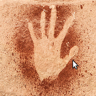

# OcherBook

## About

OcherBook is an open-source ebook reader, supporting multiple file formats and
output devices.  The major goals are:

    - Return control and privacy of the reading experience to the reader
    - Portable
    - Modular design
    - Small with few external dependencies.

## Target Devices

Perhaps the largest distinguishing implementation detail of OcherBook is that
its in-memory format is not DOM, and the rendering backends are not web
browsers.  Think DVI.  Therefore it is not going to render complex books nearly
as accurately, but it is far more portable and efficient.  This may eventually
turn out to be a mistake, but for now it's an advantage that I'm running with.

It also handles its own event loop and its own rendering, so it could
potentially run on _very_ limited devices.  This is, perhaps, the singular charm
of this project.  (OTOH, see branch `feature/qt-instead` -- but beware, this
branch will be rebased).

For embedded work, autotools can be better than the pretentiousness of CMake.  I
was re-imagining things in branch `feature/ocher2` -- but beware, this branch
will be rebased.

## Code

To get the code:

    $ git clone git@github.com:ccoffing/OcherBook.git

## Building

To get started, look in the doc directory, and/or try something simple like:

    $ cd OcherBook
    $ mkdir build
    $ cd build
    $ cmake ..
    $ make

To cross-compile, look in `cmake/toolchains` for a toolchain file for your
device.  Each toolchain file should include some notes regarding how to acquire
and install the cross-compiling toolchain.  Once you have the toolchain
downloaded and installed appropriately, configure with it like this:

    $ cd OcherBook
    $ mkdir build
    $ cd build
    $ cmake -DCMAKE_TOOLCHAIN_FILE=../cmake/toolchains/kobo.cmake ..
    $ make

Many features are configurable.  Some feature libraries can be disabled, or
enabled to build against the system's libraries, or enabled to download and
build from source (perhaps useful when cross-compiling).  For details, see
`cmake/config.cmake` or run CMake in interactive mode.

## License

OcherBook itself is GPLv3.  See COPYING.

See doc/LICENSES for all relevant licenses.

## Links

- [OcherBook](http://uscoffings.net/tech/ocherbook)
- [Hacking the Kobo Touch](http://uscoffings.net/tech/embedded/kobo-touch)

